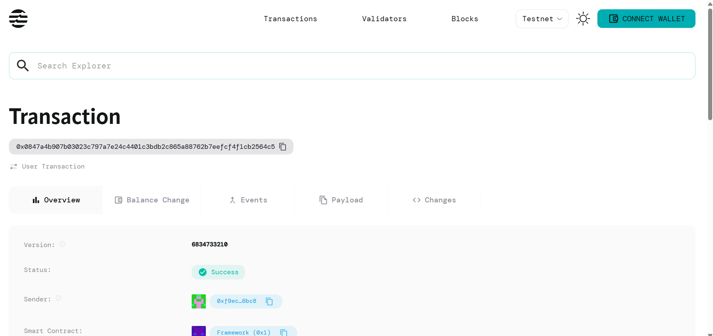

BasicNFT DApp
A full-stack NFT minting and management application built on the Aptos blockchain using Move smart contracts and React frontend.
Show Image
🌟 Features
Smart Contract (Move)

✅ NFT Minting - Create unique NFTs with metadata
✅ NFT Collection Management - Organize NFTs in collections
✅ NFT Transfer - Transfer ownership between addresses
✅ Metadata Support - Store name, description, and image URL
✅ Owner Verification - Secure ownership validation

Frontend (React + Aptos SDK)

✅ Wallet Integration - Connect/disconnect Petra Wallet
✅ Collection Initialization - Set up NFT collections for new users
✅ NFT Minting Interface - User-friendly minting form
✅ NFT Gallery - View all owned NFTs in a beautiful grid
✅ NFT Transfer - Send NFTs to other addresses
✅ Real-time Updates - Live transaction status and confirmations
✅ Responsive Design - Works on desktop and mobile
✅ Error Handling - User-friendly error messages

🏗️ Architecture
BasicNFTContract/
├── nft-frontend/          # React frontend application
│   ├── src/
│   │   ├── components/    # React components
│   │   ├── context/       # Web3 context for wallet management
│   │   ├── config/        # Contract configuration
│   │   └── hooks/         # Custom React hooks
├── sources/               # Move smart contracts
│   └── BasicNFTContract.move
└── README.md
🚀 Quick Start
Prerequisites

Node.js (v14 or higher)
Petra Wallet browser extension
Git

Installation

Clone the repository
bashgit clone https://github.com/YOUR_USERNAME/BasicNFTContract-Frontend.git
cd BasicNFTContract-Frontend/nft-frontend

Install dependencies
bashnpm install

Start the development server
bashnpm start

Open your browser
Navigate to http://localhost:3000

🔧 Configuration
Smart Contract

Contract Address: 0x0847a4b907b03023c797a7e24c4401c3bdb2c865a88762b7eefcf4f1cb2564c5
Module Name: BasicNFT
Network: Aptos Mainnet (configurable)

Update the contract configuration in src/config/contract.js:
javascriptexport const CONTRACT_ADDRESS = "YOUR_CONTRACT_ADDRESS";
export const MODULE_NAME = "BasicNFT";
export const CURRENT_NETWORK = "mainnet"; // or "testnet", "devnet"
📱 How to Use
1. Connect Wallet

Install Petra Wallet browser extension
Click "Connect Wallet" in the DApp
Approve the connection

2. Initialize Collection (First Time Users)

Click "Initialize Collection"
Approve the transaction in Petra Wallet
Wait for confirmation

3. Mint NFT

Fill in NFT details (name, description, image URL)
Click "Mint NFT"
Approve transaction and wait for confirmation

4. View Your NFTs

Your minted NFTs will appear in the gallery
Click "Refresh NFTs" to reload the collection

5. Transfer NFT

Select an NFT from your collection
Enter recipient's address
Click "Transfer NFT" and approve transaction

🛠️ Technology Stack
Frontend

React 18 - UI framework
Aptos TypeScript SDK - Blockchain interaction
CSS3 - Styling with gradients and animations
Axios - HTTP client (if needed for metadata)

Smart Contract

Move Language - Aptos smart contract development
Aptos Framework - Built-in modules and functions

Development Tools

Create React App - Development environment
VS Code - IDE with Move language support
Git - Version control

📁 Project Structure
nft-frontend/
├── public/
│   ├── index.html
│   └── manifest.json
├── src/
│   ├── components/
│   │   ├── WalletConnection.js    # Wallet connect/disconnect
│   │   └── NftInterface.js        # Main NFT functionality
│   ├── context/
│   │   └── Web3Context.js         # Web3 state management
│   ├── config/
│   │   └── contract.js            # Contract configuration
│   ├── App.js                     # Main App component
│   ├── App.css                    # Application styles
│   └── index.js                   # React entry point
├── package.json
└── README.md
🔐 Smart Contract Functions
Core Functions

initialize_collection(account: &signer) - Initialize NFT collection
mint_nft(account: &signer, name: String, description: String, image_url: String) - Mint new NFT
transfer_nft(from: &signer, to: address, nft_id: u64) - Transfer NFT ownership

Data Structures

NFT - Individual NFT with metadata
NFTCollection - Collection of NFTs for an account

🚀 Deployment
Frontend Deployment
Deploy to Vercel, Netlify, or similar platforms:
bashnpm run build
# Upload build/ folder to your hosting platform
Smart Contract Deployment
The contract is already deployed at:
0x0847a4b907b03023c797a7e24c4401c3bdb2c865a88762b7eefcf4f1cb2564c5
🧪 Testing
Manual Testing

Connect wallet ✅
Initialize collection ✅
Mint NFT with valid metadata ✅
View minted NFTs ✅
Transfer NFT to another address ✅

Network Testing

Test on Aptos Testnet before mainnet
Use testnet faucet for test APT tokens

🐛 Troubleshooting
Common Issues

"Petra Wallet not found"

Install Petra Wallet browser extension
Refresh the page

"Collection not initialized"

Click "Initialize Collection" first
Approve the transaction

Transaction fails

Check wallet balance (need APT for gas)
Ensure correct network selected

NFTs not loading

Click "Refresh NFTs" button
Check browser console for errors

🤝 Contributing

Fork the repository
Create a feature branch (git checkout -b feature/amazing-feature)
Commit changes (git commit -m 'Add amazing feature')
Push to branch (git push origin feature/amazing-feature)
Open a Pull Request

📄 License
This project is licensed under the MIT License - see the LICENSE file for details.
🙏 Acknowledgments

Aptos Labs for the blockchain infrastructure
Move Language documentation
Petra Wallet for wallet integration
React community for excellent documentation

📞 Support
If you have questions or need help:

Open an issue on GitHub
Check the Aptos documentation
Join the Aptos Discord community

